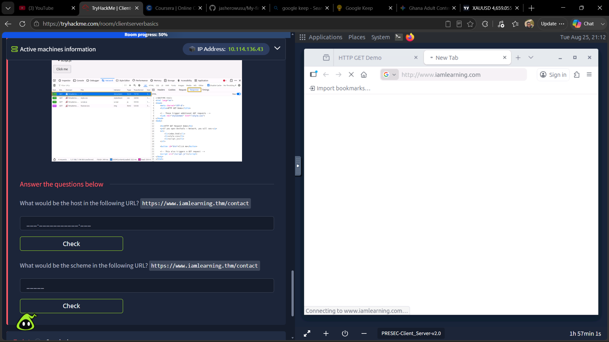
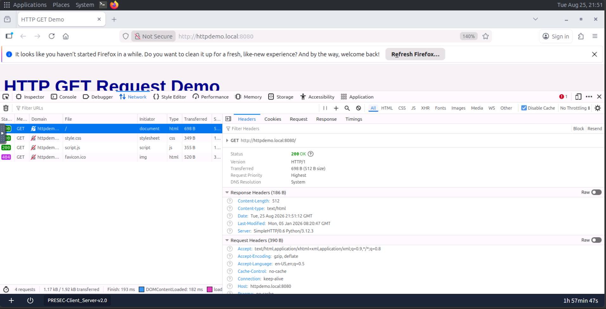

# Client-Server Basics — TryHackMe (Pre Security)

## Overview

This lab introduced the fundamentals of how clients communicate with servers over HTTP. I explored the structure of URLs, HTTP GET requests, response status codes, and basic networking tools used to investigate connectivity and DNS information.

**Platform:** TryHackMe — Pre Security

**Difficulty:** Beginner

**Date Completed:** 25 August 2026

---

## Objective

The goal of this lab was to understand how a web client requests resources from a server and how networking tools help investigate communication between devices on a network.

---

## Environment

* Platform: TryHackMe AttackBox
* Browser: Firefox Developer Tools
* Operating System: Linux (AttackBox)
* Tools Used:

  * Firefox Network Inspector
  * ping
  * traceroute
  * man
  * whois
  * dig

---

## What I Learned

### Understanding the Client-Server Model

A **client** is a device or application that sends requests for resources.

Examples include browsers, phones, and desktop applications.

A **server** stores or provides resources and responds to requests from clients.

I think of it like ordering pizza:

* The client places the order.
* The server receives the request.
* The server processes it.
* The server returns the requested resource.

This helped me understand the request-response model used on the web.

### HTTP GET Requests

A GET request asks a server for a specific resource.

Examples of resources include:

* Web pages (HTML)
* Images
* CSS files
* JavaScript files
* API responses

The browser sends a GET request and the server responds with the requested file.

### URL Components

I learned the different parts of a URL.

Using:

https://www.iamlearning.thm/contact

| Component           | Meaning                                                             |
| ------------------- | ------------------------------------------------------------------- |
| **Scheme**          | `https` — tells the browser which protocol to use.                  |
| **Host**            | `www.iamlearning.thm` — identifies the server hosting the resource. |
| **Path / Filename** | `/contact` — specifies which resource is being requested.           |

### HTTP Status Codes

The browser receives a status code from the server after making a request.

Examples I observed:

* **200 OK** — request succeeded.
* **404 Not Found** — requested resource does not exist.

---

## Networking Commands Practiced

### ping

Tests whether another device or server is reachable over the network and measures response time.

Example:

ping google.com

### traceroute

Shows each network hop that packets travel through before reaching the destination server.

### man

Displays the manual page for Linux commands.

Example:

man traceroute

### whois

Queries public registration information about a domain name.

### dig

Queries DNS records for a domain and helps investigate how domain names resolve to IP addresses.

---

## Evidence from the Lab

### Screenshot 1

Observed an HTTP GET request inside Firefox Developer Tools.

The request returned a **200 OK** response.

### Screenshot 2

Observed multiple HTTP requests made by the browser for different resources including HTML, CSS, JavaScript, and the favicon.

---

## Challenges

Initially I confused the purpose of the GET request with the `whois` command.

I learned that:

* GET retrieves resources from a web server.
* WHOIS retrieves public registration information about a domain.

I also learned that `ping` checks connectivity rather than creating a connection.

---

## Key Takeaways

* Every website interaction follows a request-response model.
* Browsers automatically make multiple GET requests to load a page.
* URLs are made of several components that identify how and where a resource is requested.
* Basic networking tools provide different kinds of information about connectivity, routing, and DNS.

.
Figure 1. Firefox Developer Tools showing multiple HTTP GET requests generated while loading a webpage.


Figure 2. Inspecting an HTTP GET request returned a 200 OK status and displayed both request headers and response headers.


## Security Perspective

This lab showed me how browsers communicate with web servers using HTTP requests.

From a cybersecurity perspective, understanding this traffic is important because analysts often inspect HTTP requests and responses to detect suspicious behaviour, malicious downloads, web attacks, or unexpected communications between clients and servers.

This foundation will be useful later when learning packet analysis with Wireshark and investigating network traffic in a SOC environment.     


## Commands Practiced

### ping

```bash
ping google.com
```

**Purpose**

Checks whether a remote host is reachable and measures network latency using ICMP Echo Requests.

**What I observed**

The terminal returned replies from Google's server along with response times measured in milliseconds.

---

### traceroute

```bash
traceroute google.com
```

**Purpose**

Displays the path packets travel through routers before reaching the destination.

**What I observed**

The output listed multiple hops between my machine and the destination.

---

### whois

```bash
whois tryhackme.com
```

**Purpose**

Retrieves publicly available registration information for a domain.

**What I observed**

The output included the registrar, registration dates, and nameserver information.

---

### dig

```bash
dig tryhackme.com
```

**Purpose**

Queries DNS records for a domain.

**What I observed**

The command returned the IP address associated with the domain along with DNS record information.

## Reflection

### What clicked for me

The client-server model finally made sense when I compared it to ordering pizza. The client sends a request, the server processes it, and returns a response.

### What confused me

I initially thought an HTTP GET request was used to retrieve company registration information. After completing the lab, I understood that GET requests retrieve web resources, while WHOIS retrieves domain registration information.


